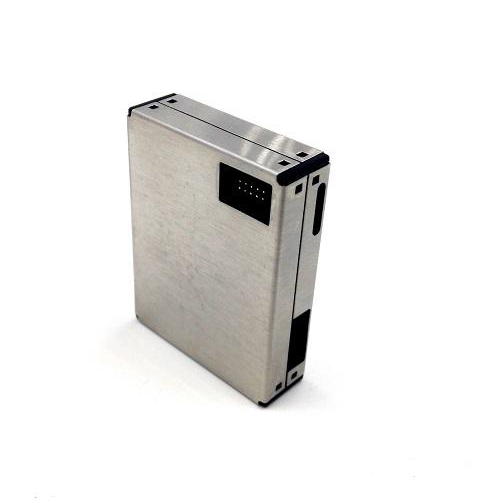
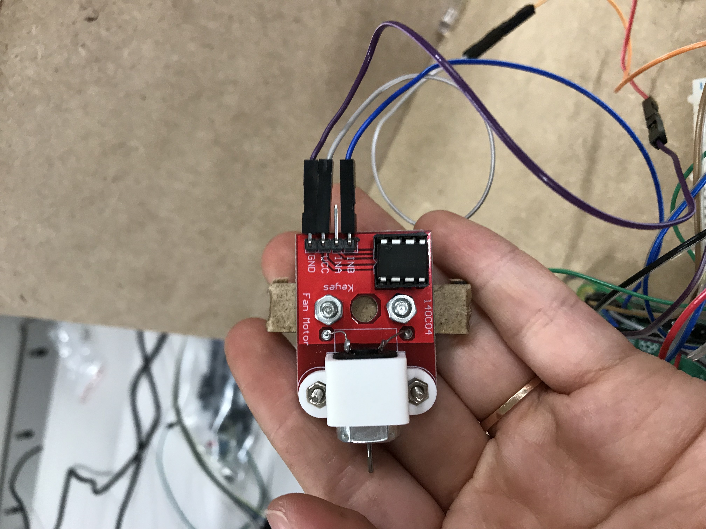
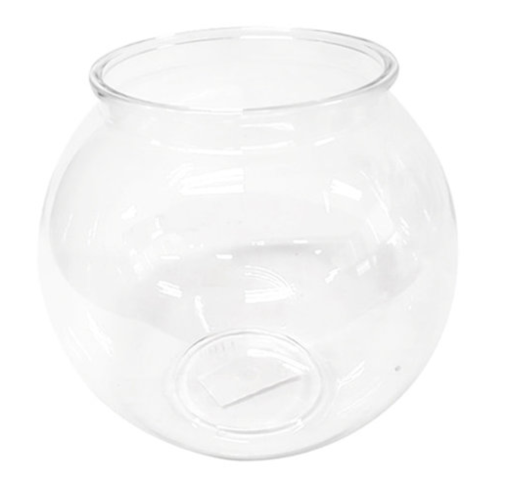
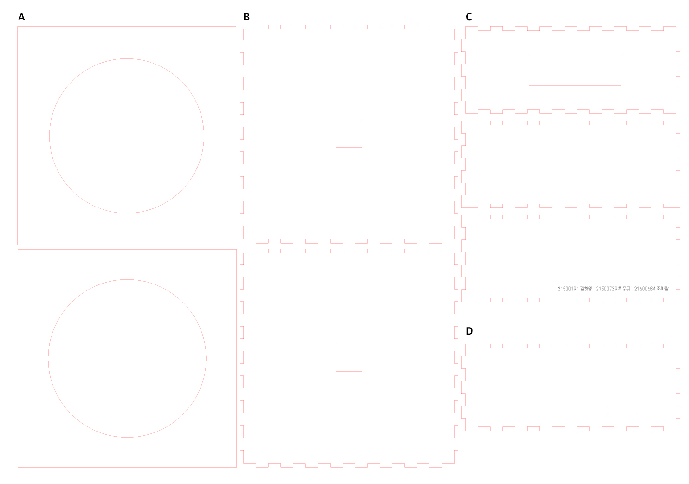

# MICRODUST PROJECT

**프로젝트 참여 인원** 21500191 김하영 / 21500739 최용규 / 21600684 조예람


## 00 ITEM SUMMARY

#### [HARDWARE]
하드웨어에 장착된 미세먼지 측정기를 통해 실내의 미세먼지 농도를 파악하고 국가 데이터를 받아와 동시에 외부 미세먼지 농도를 함께 시각화해서 표현함. 대상인 아이들이 즉각적으로 미세먼지가 심함을 스스로 느낄 수 있게, 스노우볼 모양의 하드웨어로 그 안에 미세폼이 미세먼지가 심할 수롣 바람이 세게 불어 더 많이 날아다니도록 표현했다. 또한 미세먼지의 심각성을 단순하게 수치로 알려주는 것이 아니라, 집에 두고 사용함으로, 심미적인 인테리어 용품으로 활용할 수 있는 아이들의 감성인 뽀로로를 담은 스노우볼 모양의 측정기이다. 추가적으로 미세먼지 알림 기능 외에 무드등의 기능도 갖추었다.


#### [SOFTWARE]
“마이크로 가드”는 외부 미세먼지 농도와 더불어 실내의 미세먼지 측정값을 사용자에게 알려주고 지정된 정도에 따라서 자동으로 환기, 공기청정기 가동 등의 기능을 실행하거나 쉽게 조정할 수 있는 인터페이스를 제안함을 통하여서 보다 안전하고 쾌적한 실내의 환경을 구축할 수 있도록 도와주는 똑똑한 경비원의 역할을 수행한다.

## 01 INTRODUCTION
#### 1-1 Background
  세계보건기구(WHO)가 발암물질로 지정한 미세먼지는 어린이에게는 더 많은 악영향을 미친다. 어린이들은 어른보다 활동량과 호흡량이 많아 그만큼 미세 먼지에 노출되는 빈도도 높고 흡입량도 많기 때문이다. 미세 먼지는 입자가 작아 한번 유입되면 체외 배출이 어려운데, 어린이가 성장하면서 몸 안에 쌓인 미세 먼지는 지속적으로 치명적인 해를 입힌다. 2010년 인하대병원이 인천 지역 초등학생들을 대상으로 조사한 결과 대기오염 물질이 학생들의 폐기능을 약화시키는 것으로 나타났다.하지만 이런 심각성에도 어린이들은 그 심각성을 인지 능력이 약하기에 답답한 마스크를 쓰기 싫어하며, 스스로 챙겨서 하는 경우도 드물다. 미세 먼지 농도가 매우 나쁨' 수준인 날에도 미세 먼지 마스크를 착용하지 않고 등교하는 어린이들은 많다. 

   게다가 이런 미세먼지의 악영향은 밖에서만 있는 것이 아니라, 집 안에서도 이어진다. 미국 환경 보호국은 실내 대기오염이 실외 대기오염보다 2배에서 5배 더 심하다는 연구 결과를 최근 발표했다. 적절한 실내 환기를 하지 않을 경우 실외 대비 실내공기 오염이 최대 100배까지 증가할 수 있는 것으로 알려져 있다. 


#### 1-2 Purpose
“아이들에게 더 유해한 미세먼지,   
어떻게 전달하면 아이들이 거부감없이 받아드릴 수 있을까?” 


#### 1-3 Target Segment
- 만3세부터 만7세까지의 아이들을 키우는 부모님
- 외부와 내부 미세먼지 데이터를 전부 받아보고 싶은 사람
- 심미적인 미세먼지 알림 하드웨어를 가지고 싶어하는 사람


#### 1-4 Value Proposition
- 아이들이 미세먼지 심각성을 깨달을 수 있도록 한다.
- 마스크를 답답해 하는 아이들이 스스로 마스크를 착용할 수 있게 한다.
- 미세먼지의 농도를 직관적으로 확인할 수 있다.
- 집 안의 인테리어 용품으로 사용가능 하다.

## 02 HARDWARE
##### 뽀로로 더스트 볼
#### 2-1 기능작업 
더스트볼의 기능 수행을 위한 작업은 다음과 같이 총 4가지로 구성된다.
- 미세먼지 값 측정
- LED 색상 변환
- 모터 속도 제어
- LCD 값 출력
- …

차례차례 알아보도록 하자.


##### 2-1-1 미세먼지 값 측정
- 세팅

	미세먼지 값 측정을 위해서는 PSM7003라는 미세먼지 측정 센서를 사용한다.
PSM7003을 동반되어 제시된 기판에 꼽은 후에  GND 에는 라즈베리 파이의 GPIO 핀중 GROUND 를 담당하는 핀을, VCC에는 3x3 전압을 공급하는 핀을, RX에는  GPIO 15번, TX에는 GPIO14번을 연결함을 통하여 값을 받아올 수 있도록 연결한다.

- 코드

	코드는 교수님께서 주신 코드를 모체로 하여 작업을 진행한다.  대신 기존의 입력된 셀에 값을 덧붙이는 형식에서 더 나아가, sensor.getLastReading() 을 작동하는 부분에서 셀의 값을 1씩 증가시킴을 통해 값이 꾸준히 들어올 수 있도록 수정한다.

- 실행

	실행을 위해서는 명령어 sudo pigpiod 를 먼저 입력합을 통하여서 GPIO핀을 활성화 시킨 후에 python3 명령어를 통하여 코드를 실행시켜야 한다.


##### 2-1-2 LED 색상 변환
- 세팅

	*RGB LED를 사용하는 것이 공간적으로나, 코드상으로나 효율적이지만 부품 수급이 늦게 이루어진 관계로 각 색의 LED를 사용하였다. 본 프로젝트에서는 PM2.5 측정값의 정도를 4구간으로 나누어서 색으로 구분한다.
    
  | Color        | Standard           | Details  |
  | :-------------: |:-------------:| :-----:|
  | 파랑      | 아주 좋음 | 0<= PM2.5 < 16 |
  | 주황      | 보통      |   16<= PM 2.5 < 36 |
  | 주황 | 나쁨      |    36<= PM 2.5 < 76 |
  | 빨강 | 아주나쁨      |    76 <=PM2.5 |

  (대한민국 미세먼지 농도 구분 기준 참고)

	LED는 다리가 긴쪽이 + , 짧은쪽이 - 로 구성되어 있다.따라서 이에 맞게 짧은 쪽에는 GROUND 핀을 꼽고 , + 쪽에는 신호에 따라서 전압의 전달이 가능한 GPIO핀을 꼽는다.

	이를 바탕으로 전체적인 작동 원리는 신호에 따라서 +가 전압을 전달하거나, 차단하거나 의 방식을 통해 LED를 점등하는 방식으로 진행된다.

- 코드

  - GPIO.setwarnings(False)을 먼저 작성함을 통해 GPIO가 잘못 꼽혔을 시에 나오는 변수를 통제하고 시작한다.
  - GPIO.setmode(GPIO.BOARD) 을 통하여 GPIO 핀을 읽는 BCM 모드와 BOARD모드 중에서 BOARD모드로 GPIO의 핀 값을 설정한다.
  - GPIO.setup(40,GPIO.OUT) +에 연결된 GPIO 핀의 Board 값을 인자로 넣어주고, 그 핀을 전압을 출력하는 핀으로 사용하겠다고 선언한다.
  - GPIO.output(40,GPIO.HIGH) 를 통하여 GPIO 핀에 전압을 출력한다. 이는 LED를 키는 동작으로 나타난다.
  - GPIO.output(40,GPIO.LOW) 를 통하여 GPIO 핀의 전압을 제거한다. 이는 LED를 끄는 동작으로 나타난다.


##### 2-1-3 모터 속도 제어
 
- 세팅
 
  모터는 충분한 량의 풍속을 위하여 DC 모터를 사용한다. 라즈베리파이가 5v 까지만 전압을 제공함으로, 5v이내의 전압으로 가용 되는 모터를 사용하는 것을 권장한다.

    모터의 속도 제어는 LED의 점등과 같이 0 과 1로 만 구성되는 것이 아니라, 더 다양한 값의 input이 필요하기 때문에 모터 드라이버 라는 것이 필요하다.

    단순한 제어를 위해서는L9110을, 보다 정교하고 큰 전압의 제어를 위해서는 L298n 드라이버를 추천한다.
    L9110의 GND 에는 Ground 핀을, VCC에는 5v의 전압을 제공하는 핀을 꼽는다.
    여기서 중요한 것은 In B 핀으로서, 여기에 들어오는 신호를 통해 제어를 가능하게 한다.
 
	모터가 제어되는 원리는 모터값의 주기를 변화시킴을 통하여 속도를 제어하는 것으로 따라서 INB 핀에는 GPIO 핀 중에 주기값을 제어할 수 있는, 소위 말해 pmw 값의 출력을 줄 수 있는 GPIO18, 또는 board number 12번 핀을 연결해야 한다. 
 
- 코드
  - GPIO.setup(pin_pwm, GPIO.OUT) LED와 동일하게 INB에 연결된 GPIO 핀을 출력해주는 핀으로 설정한다.
  - frequency = 10000 모터의 주기값을 설정해주는 과정으로, 이 값과 속도는 반비례하게 된다. 값을 늘려줌을 통해 속도 변환의 폭을 더욱 늘려줄 수 있다.
  - p = GPIO.PWM(pin_pwm, frequency) 설정한 주기값과 핀 번호를 바탕으로 객체를 생성한다. 
  - p.start(10) 마지막으로  몇 퍼센트로 출력을 실행할지 설정한 후에, 이를 바탕으로 모터의 작동을 시작한다.
  - p.stop() 모터를 멈춘다.
  
    따라서 frequency의 값을 변경함을 통해 속도를 제어하거나, start로 전달하는 값의 변화를 통하여 모터의 속도를 제어한다.


##### 2-1-4 LCD 출력

- 세팅

  LCD는 16*2 기본 LCD 를 사용하여, 윗줄과 아랫줄로 총 2줄의 라인에 원하는 값을 출력할 수 있는 모듈을 사용하였다.

  LCD의 온전한 출력을 위해서는 LCD 뒷판에 있는 16개의 핀중 14개의 핀을 연결하는 대 작업이 필요하다.
  LCD가 사용자 쪽을 바라보도록 놓은 후에, 맨 왼쪽에 있는 핀을 1번으로 두고 다음과 값은 세팅을 진행하면 된다.

  | LCD 핀숫자        | 라즈베리파이 핀숫자           |
    | :-------------: | :-----:|
    | 1      |GND | 
    | 2      | 5V      |
    | 3 | 5V      |
    | 4 | GPIO 26 *BCM모드 기준 번호이다      |
    | 5 | GND      |
    | 6 | GPIO 19      |
    | 7~10 | 사용하지 않음      |
    | 10 | GPIO 13      |
    | 11 | GPIO 6      |
    | 12 | GPIO 5      |
    | 13 | GPIO 11      |
    | 14 | GPIO 14      |
    | 15 | 5V      |
    | 16 | GND      |

	보다 정확한 정보를 위하여 참고한 유투브 링크를 남긴다: https://youtu.be/cVdSc8VYVBM 

- 코드

  다음은 출력을 위한 기본적인 코드들이다.

```python
      import lcd
```

  동영상에 첨부되어있는 lcd.py 코드를 바탕으로 import 해온다.


  ```python
      lcd.lcd_init()
  ```

  lcd를 초기화 해주는 작업이다.

  ```python
      lcd_byte(LCD_LINE_1, LCD_CMD)
  ```
 
상간 줄과 하단 줄 중, 작성을 원하는 곳의 위치를 선언해준 후에

  ```python
      lcd_string("Great", 2)
  ```

  입력하길 원하는 값을 작성해준다.

  ```python
      lcd_byte(LCD_LINE_2, LCD_CMD) 
  ```

  Line 2 로서, 위의 코드와 다르게 하단에 출력을 해준다.

  ```python
      lcd_string("Humidity: ", 2)
  ```

#### 2-2 외관작업 

레이저커팅을 이용해 하드웨어 외관을 만들어야하기 때문에 하드웨어 내에 들어갈 요소들이 확정 된 후에 외관 작업을 진행한다. 외관작업은 크게 아래와 같이 분류할 수 있다.
- 둥근 투명 볼 (스노우 볼의 뚜껑 역할)
- 스노우 볼의 몸통
- 스노우 볼 내부 요소 (뽀로로 집, 뽀로로, 우체통)


##### 2-2-1 둥근 투명 볼 → 시중 제품 사용

기존 스노우 볼의 뚜껑은 유리로 되어 있지만 무게와 접근성을 고려해 투명 플라스틱으로 이뤄진 볼을 사용한다. 본 프로젝트에서는 투명 플라스틱 어항을 사용하였다.
 
**[사이즈]**   
입구지름: 11cm   
가로: 17cm    
높이: 16.5cm   

**[구매링크]**   
https://smartstore.naver.com/hjungle/products/2591877402   

##### 2-2-2 스노우 볼의 몸통 → 레이저커팅

스노우 볼의 몸통은 제품에 따라 다양한 모양을 가지고 있지만 본 프로젝트에서는 각도가 없는 직육면체의 모양을 선택하여 작업했다. 레이저커팅은 adobe ai프로그램을 활용해 디자인하였고 아래의 규칙에 따라 디자인 한다.
 
**[자르는 선]**             
R 255 / G 0 / B 0      
Stroke: Basic 0.1pt        

**[음각 선]**              
R 0 / G 0 / B 255      
Stroke: Basic 0.75pt    

아래는 완성 된 위한 도면이다.    


**[사이즈]** *완성된 몸통 기준   
165mmX165mmX60mm 
 

[A]   
가운데 원은 플라스틱 어항을 끼워 고정시키기 위해 사용되어진다. 완성된 몸통 위에 별도로 올려 고정한다. 높이를 더 높여야할 경우 테두리에 추가적으로 덧대어 높이를 맞춘다.


[B]   
가운데 있는 정사각형은 몸통의 윗면과 아랫면이다.
- 윗면은 볼 안에 구성될 요소들(led, motor)과 라즈베리 파이를 연결하기위해 전선이 지나가는 공간 확보를 위해 구멍을 낸다. 모양이 딱 맞게 재단되었어도 헐겁기 때문에 고정하기 위해서는 순간접착제를 활용해야한다.
- 아랫면의 정사각형은 라즈베리파이에 전원을 공급하기 위한 전원선을 밖으로 빼기 위한 자리 확보를 위한 구멍이다. 

[C]   
옆면에 있는 직사각형은 LCD스크린 사이즈가 고정 될 수 있도록 사이즈를 맞춰 재단한다.

[D]   
다른 쪽 옆면에는 몸체 안에 있는 미세먼지 센서가 제대로 된 값을 받아 올 수 있도록 공기를 흡입하는 크기에 맞춰 재단한다.   

** 미세먼지 센서의 높이와 크기에 따라 수정이 필요하다.   

##### 2-2-3 스노우 볼 내부 요소 → 레이저커팅

스노우 볼 내부에는 창문과 풍차가 포함 된 뽀로로 집, 뽀로로, 우체통, 미세폼이 들어간다. 스노우볼 몸통에서 사용 했던 ai툴과 규칙을 그대로 적용하여 작업한다. 
 
**[자르는 선]**             
R 255 / G 0 / B 0      
Stroke: Basic 0.1pt        

**[음각 선]**              
R 0 / G 0 / B 255      
Stroke: Basic 0.75pt      

아래는 완성 된 위한 도면이다. 

[E]      
집 모형의 앞뒷면과 같이 개인의 취향에 따라 음각으로 무늬나 패턴을 추가할 수 있다.

[F]      
빨간선대로 재단이 될 것이기 때문에 무늬가 빨간선을 넘어가도 상관 없다.

[G]      
크기에 맞게 겹쳐 사용하는데 이는 전체적인 집의 높이를 높여주고 안정감을 더해줄 수 있는 디딤돌 같은 역할을 한다. 가운데 있는 정사각형은 스노우볼 몸통 윗면과 같이 전선을 위한 공간 확보를 위해 필요하다. 가장 긴면이 어항의 입구 지름보다 작게 설명하여 비율을 맞춰 작업한다. 
      
**모든 레이저커팅 도안은 최종 완성본이 아니기 때문에 수정이 필요하다.      

레이저커팅 후 조립 완료한 형태는 다음과 같다.


레이저커딩 작업 모습


##### 2-2-3 최종적 조립

최종적인 조립은 내부에 필요한 코딩와 레이저커팅이 모두 완료한 상태에서 진행한다.
1. 스노우 볼 안쪽에서는 미세먼지 농도에 따라 풍차가 돌기 떄문에 창문틈 사이로 미세폼이 들어가지 않도록 기름종이를 덧대어 붙인다.
2. 준비 된 집 모형에 모터와 led선의 자리를 확정하고 고정한다.모터를 안정적으로 고정하기 위해서 모터모듈 아래에 지지대를 추가적으로 설치한다. 
3. 뚜껑을 닫은 후 모든 부품을 고정 시킨 후 지붕과 집사이에 있는 틈에 미세폼이 들어가지 않도록 마스킹 테이프로 막는다.
4. 내부에 들어갈 윗판에 집모형과 우체통이 들어가도록 고정시킨다. 본드를 이용하거나 구멍을 내어 끼는 방법 둘다 가능하다.
5. 아래의 이미지와 같이 라즈베리파이와 각 센서의 자리를 잡는다.선이 빠지거나 엉키지 않도록 마스킹 데이프를 이용해 묶어 두는 것도 좋다. 
6. 어항에 미세폼을 적정량 채워 넣는다. 미세먼지를 상징하는 미세폼을 사용하는데 약한 바람에도 잘 날릴 수 있도록 입자가 작은 미세폼을 메인으로 사용하고 중간중간에 색깔이 있는 미세폼과 사이즈가 더 큰 폼도 같이 넣어 재미요소를 더했다.

[구매처]      
미세폼의 경우 문구점이나 온라인에서 쉽게 구매가 가능하다.      
7. 미세폼까지 추가해 모든 부분을 고정 시킨 후 바닥면이 울퉁거리지 않도록 추가적으로 합판을 덧대 전원선이 사방으로 지나갈 수 있는 공간을 만들어 준다. 
8. 전원을 연결하여 작동을 확인한다.


## 03 SOFTWARE
##### 마이크로 가드
#### 3-1 모바일 어플리케이션 설명
하드웨어와 더불어 각 가정에 미세먼지 관리에 있어 다양한 기능을 제공하기 위해 제작한 “마이크로 가드”는 외부 미세먼지 농도와 더불어 실내의 미세먼지 측정값을 사용자에게 알려준다. 이 뿐만 아니라 지정된 정도에 따라서 자동으로 환기, 공기청정기 가동 등의 기능을 실행하거나 쉽게 조정할 수 있는 인터페이스를 제안함을 통하여서 보다 안전하고 쾌적한 실내의 환경을 구축할 수 있도록 도와주는 똑똑한 경비원의 역할을 수행한다.

#### 3-1 모바일 어플리케이션 설명
- 로그인 화면      
	집의 위치와 환경을 맞춤형으로 설정하고 저장하기 위한 개인 로그인 화면이다.
    
- 메인 화면      
	외부의 미세먼지 농도와 실내 미세먼지 농도를 동시에 확인하고 비교할 수 있어서 현재 상황을 더욱 빠르게 파악할 수 있다. 외부 미세먼지 농도는 사용자의 위치에 따라 공공데이터를 불러와 출력하고 실내 미세먼지 농도는 뽀로로 더스트 볼에서 측정되는 값을 출력한다.

- 실내 설정 화면      
	실내 창문의 개폐여부와 공기청정기 가동 여부를 보여주며 어플을 통해 작동이 가능하다. 이를 통해 미세먼지 농도에 따른 즉각적인 피드백을 도와준다.

- 기기 설정 화면      
	목표한 값에 도달 할 수 있도록 실내의 환경을 자동으로 조정하여 쾌적한 환경을 구성할 수 있도록 도와준다.
